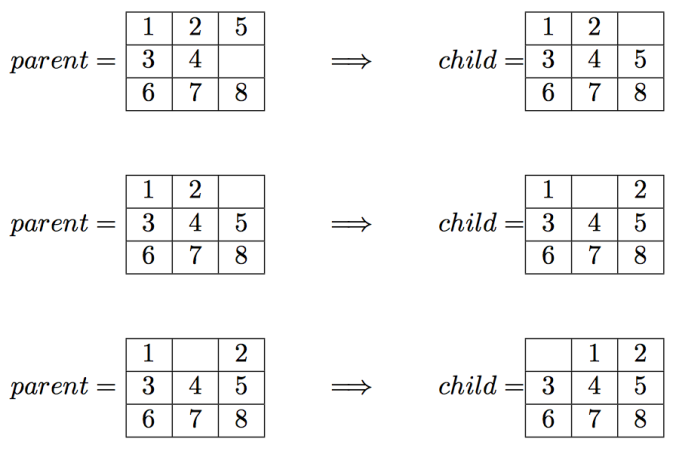
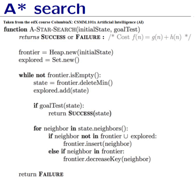
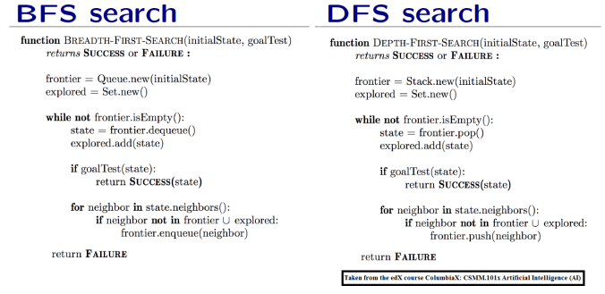

# N-Puzzle

This library has algorithms for solving the 8-Puzzle problem. It's a defacto problem in AI.

The input of the game is a state of the 8-Puzzle




The library implements
- DFS
- BFS
- A* with heuristics
    - Manhattan Distance
    - Euclidean Distance
    
The code exists in `solvers.kt` and it's almost a one to one mapping of the Pseudocode

### A*



### DFS & BFS



## Building

To build the project run
```bash
gradle jar
``` 


## The code uses Data Structures from the following repos

[Queue](https://github.com/gazolla/Kotlin-Algorithm/tree/master/Queue), 
[Stack](https://github.com/gazolla/Kotlin-Algorithm/blob/master/Stack/Stack.kt)
